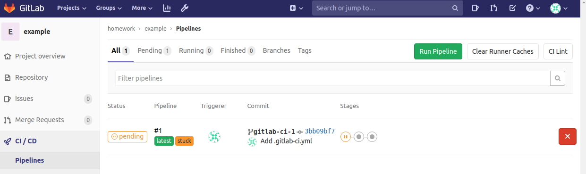

# shaadowsky_microservices
shaadowsky microservices repository

## GitlabCI, построение непрерывной поставки

### план

• Подготовить инсталляцию Gitlab CI
• Подготовить репозиторий с кодом приложения
• Описать для приложения этапы пайплайна
• Определить окружения

### Инсталляция Gitlab CI

Для выполнения этого ДЗ нам потребуется развернуть свой Gitlab CI с помощью Docker. CI-сервис является одним из ключевых инфраструктурных сервисов в процессе выпуска ПО и к его доступности, бесперебойной работе и безопасности должны предъявляться повышенные требования.

упростим процедуру установки и настройки. 

Gitlab CI состоит из множества компонент и выполняет ресурсозатратную работу, например, компиляция приложений. Нам потребуется создать в Google Cloud новую виртуальную машину со следующими параметрами:
• 1 CPU
• 3.75GB RAM
• 50-100 GB HDD
• Ubuntu 16.04

Развернём такую машину с помощью вебпанели gconsole.

Для запуска Gitlab CI будем использовать omnibus-установку, у этого подхода есть как свои плюсы, так и минусы. Основной плюс для нас в том, что мы можем быстро запустить cервис и сконцентрироваться на процессе непрерывной поставки. Минусом такого типа установки является то, что такую инсталляцию тяжелее эксплуатировать и дорабатывать, но долговременная эксплуатация этого сервиса не входит в наши цели.

Более подробно об этом в [документации](https://docs.gitlab.com/omnibus/README.html)

Натыкаем через вебконсоль нужную машину в GCP (стоит попробовать на других ОС, но т.к. на курсе убунту 1604, то проверка тревисом не пройдёт) и развернем докер, докер-композ скриптом из ./gitlab-ci/prep.sh.

Если все прошло успешно, то вы сможете в браузер перейти на http://<your-vm-ip> и форму установки пароля. Создаем пароль, входим под дефолтным пользователем root. После этого снимаем галку в настройках с sign-up enabled,te создаем группу homework c проектом example. Также необходимо создать токен лдя авторизации при пуше. По сути это тот же пароль.

====
root токен - WFDczZMhskYucu7e_7EB
====

Добавляем remote в <username>_microservices

> git checkout -b gitlab-ci-1
> git remote add gitlab http://<your-vm-ip>/homework/example.git
> git push gitlab gitlab-ci-1

переходим к определению ci/cd Pipeline для проекта. Для этого надо добавить в репу файл .gitlab-ci.yml

```code
stages:
  - build
  - test
  - deploy

build_job:
  stage: build
  script:
    - echo 'Building'

test_unit_job:
  stage: test
  script:
    - echo 'Testing 1'

test_integration_job:
  stage: test
  script:
    - echo 'Testing 2'

deploy_job:
  stage: deploy
  script:
    - echo 'Deploy'
```

После чего сохраняем файл
> git add .gitlab-ci.yml
> git commit -m 'add pipeline definition'
> git push gitlab gitlab-ci-1

Теперь если перейти в раздел CI/CD мы увидим, что пайплайн готов к запуску. Но находится в статусе pending / stuck так как у нас нет runner



Запустим Runner и зарегистрируем его в интерактивном режиме

Перед тем, как запускать и регистрировать runner нужно получить токен. Settings - CI/CD - Runners settings - Set up a specific Runner manually

runner-token = U4oziTywsa9sP5orKX1wyWx_

на сервере, где работает gitlab ci выполнить команду:

```
docker run -d --name gitlab-runner --restart always \
-v /srv/gitlab-runner/config:/etc/gitlab-runner \
-v /var/run/docker.sock:/var/run/docker.sock \
gitlab/gitlab-runner:latest 
```

После запуска Runner нужно зарегистрировать, это можно сделать так:

```bash
root@gitlab-ci:~# docker exec -it gitlab-runner gitlab-runner register --run-untagged --locked=false
Please enter the gitlab-ci coordinator URL (e.g. https://gitlab.com/):
http://<YOUR-VM-IP>/
Please enter the gitlab-ci token for this runner:
<TOKEN>
Please enter the gitlab-ci description for this runner:
[38689f5588fe]: my-runner
Please enter the gitlab-ci tags for this runner (comma separated):
linux,xenial,ubuntu,docker
Please enter the executor:
docker
Please enter the default Docker image (e.g. ruby:2.1):
alpine:latest
Runner registered successfully.
```

Если все получилось, то в настройках вы увидите новый runner 

Добавим исходный код reddit в репозиторий
> git clone https://github.com/express42/reddit.git && rm -rf ./reddit/.git
> git add reddit/
> git commit -m “Add reddit app”
> git push gitlab gitlab-ci-1

Добавим тестов, Изменим описание пайплайна в .gitlab-ci.yml 

```code
...

...

variables:
  DATABASE_URL: 'mongodb://mongo/user_posts'

before_script:
  - cd reddit
  - bundle install

test_unit_job:
  stage: test
  services:
    - mongo: latest
  script:
    -ruby simpletest.rb
  script:
    - echo 'Testing 1'
  
...

...
```

В описании pipeline мы добавили вызов теста в файле simpletest.rb, нужно создать его в папке reddit

```code
require_relative './app'
require 'test/unit'
require 'rack/test'

set :environment, :test

class MyAppTest < Test::Unit::TestCase
  include Rack::Test::Methods

  def app
    Sinatra::Application
  end

  def test_get_request
    get '/'
    assert last_response.ok?
  end
end
```

Последним шагом нужно добавить библиотеку для тестирования в reddit/Gemfile приложения. Добавим gem 'rack-test'


```code
gem 'bcrypt'
gem 'puma'
gem 'mongo'
gem 'json'
+ gem 'rack-test'
```

Теперь на каждое изменение в коде приложения будет запущен тест

Вернемся к академическому пайплайну, который описывает шаги сборки, тестирования и деплоймента. 

Изменим пайплайн таким образом, чтобы job deploy стал определением окружения dev, на которое условно будет выкатываться каждое изменение в коде проекта.

1. Переименуем deploy stage в review.
2. deploy_job заменим на deploy_dev_job
3. Добавим environment

```code
deploy_dev_job:
  stage: deploy
  script:
    - echo 'Deploy'
  environment:
    name: dev
    url: http://dev.example.com
```

После изменения файла .gitlab-ci.yml не забывать зафиксировать изменение в git и отправить изменения на сервер. (git commit и git push gitlab gitlab-ci-1)

